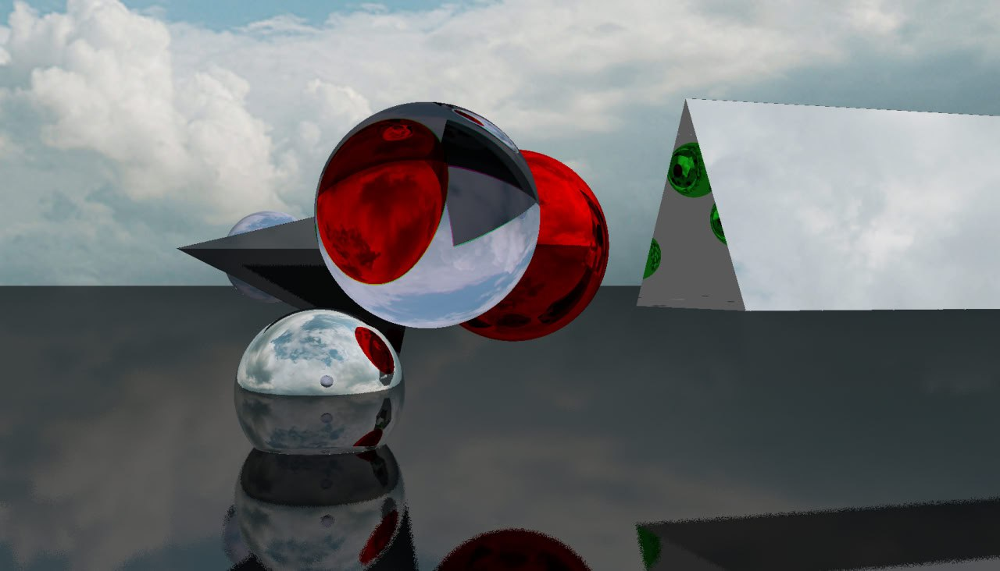
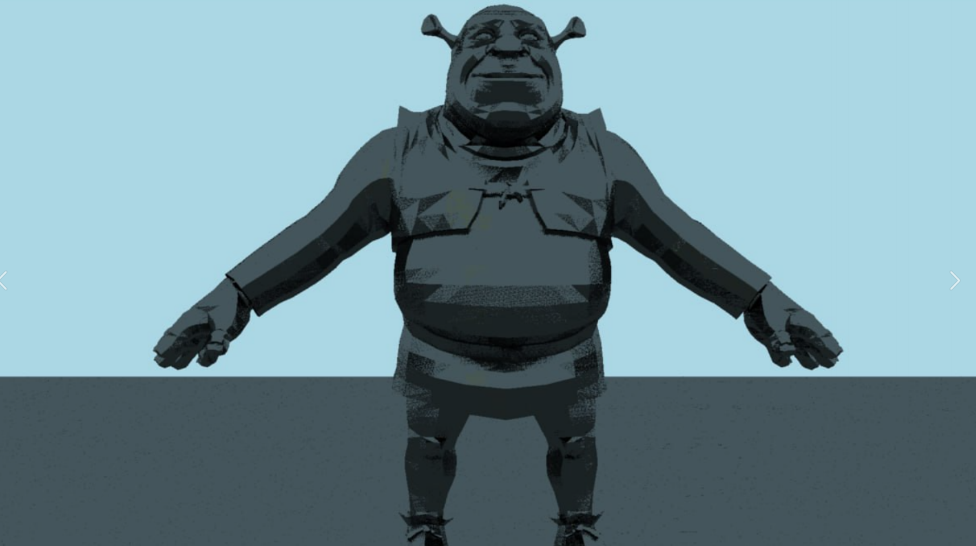
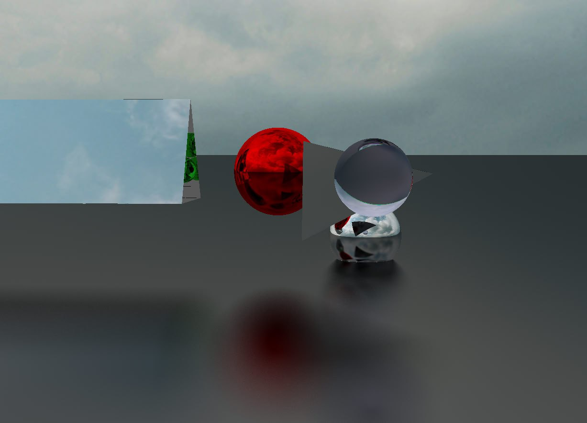
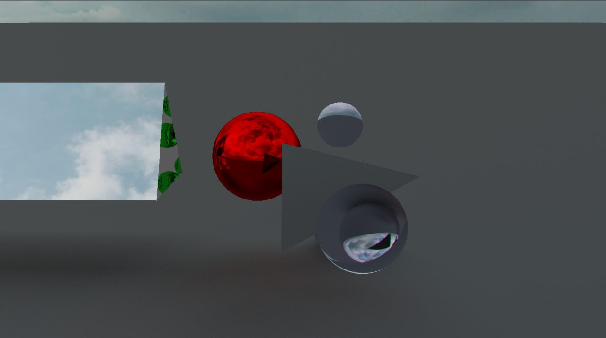
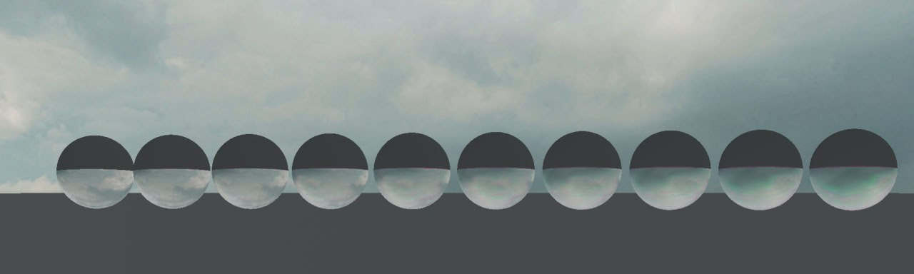
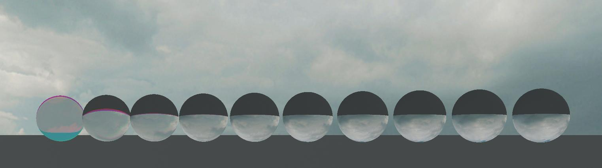
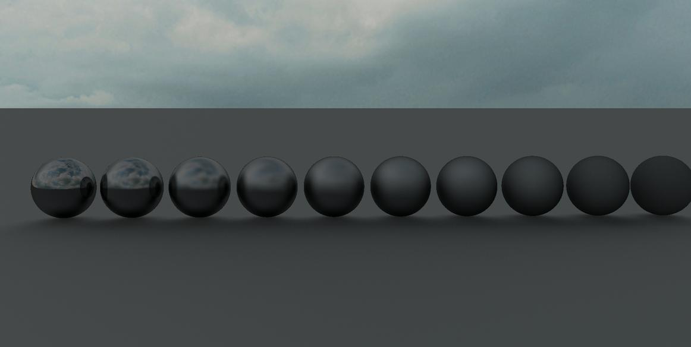
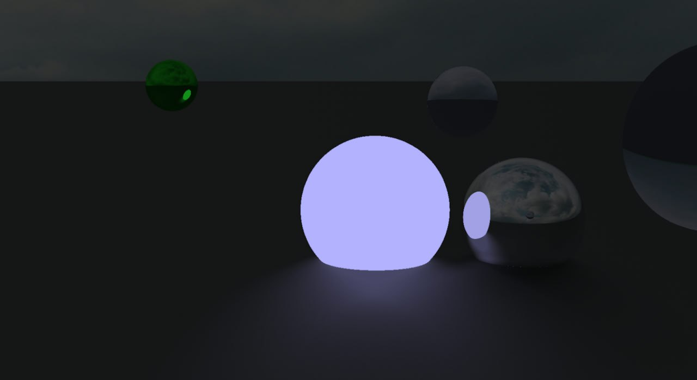

# Real engine(3d engine)

## Demo

Blender 3d models support isn't merged into master as it's only PoC at the moment.
You can find it in feature/shrek branch.

## Setup

Create venv

    python3 -m venv .env
    . ./.env/bin/activate

Install dependencies

    pip3 install -r requirements.txt

## Run

Activate venv and run

    . ./.env/bin/activate
    cd engine
    python3 main.py

## Features

- Gpu acceleration
- Transparrent materials
- Rough materials
- Light dispertion and chromatic aberration
- Sampling (reduces noise by calculating mean color of all frames since last move for each pixel)
- Sky texture

PoC only

- Blender 3d models support
- Light sources

## More pictures

